#  Credit Without Barriers

A web-based microloan platform that connects borrowers and lenders with a secure, transparent, and community-driven approach.

---

##  Features

-  Multi-role Authentication (Borrower, Lender, Admin)
-  OTP-based Login System
-  Borrower Loan Requests
-  Lender Offer System
-  Admin Dashboard & Controls
-  Agreement Generation (PDF)
-  Real-time Loan Tracking

---

##  Tech Stack

- Frontend: HTML, CSS, Bootstrap  
- Backend: PHP  
- Database: MySQL  

---

##  Screenshots

###  Home Page
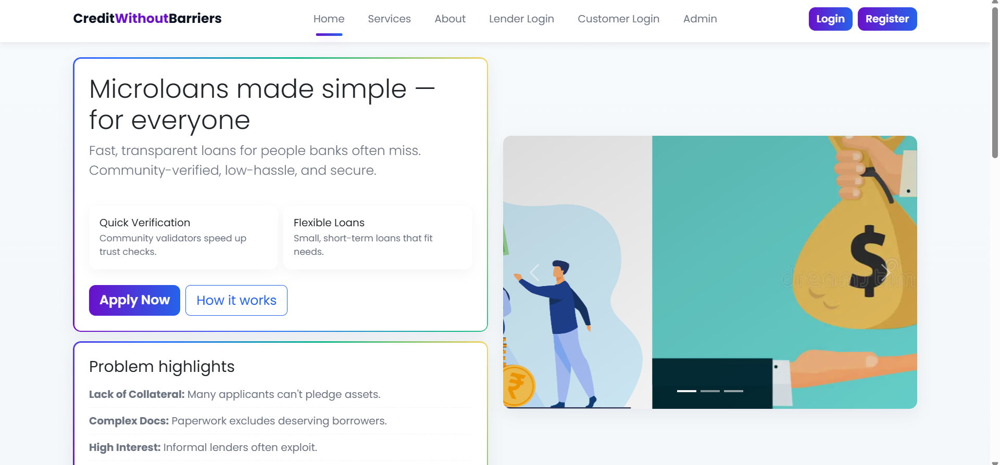

---

###  Services
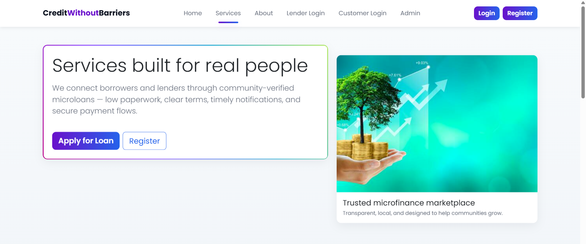
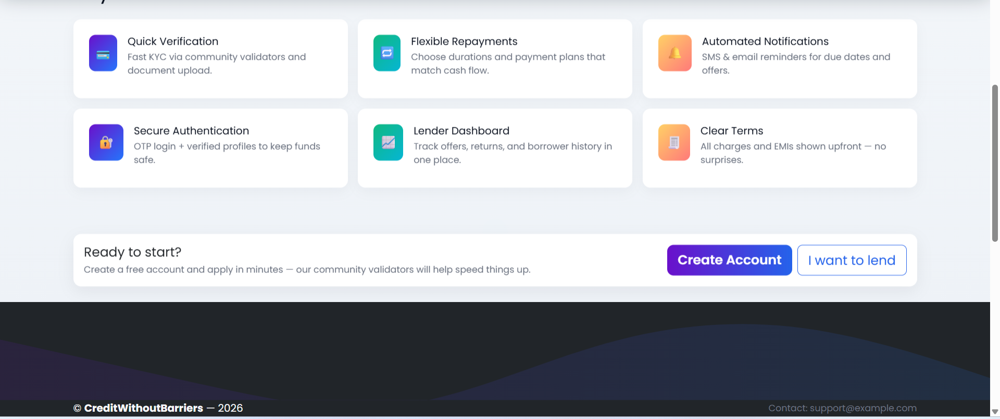

---

###  Authentication
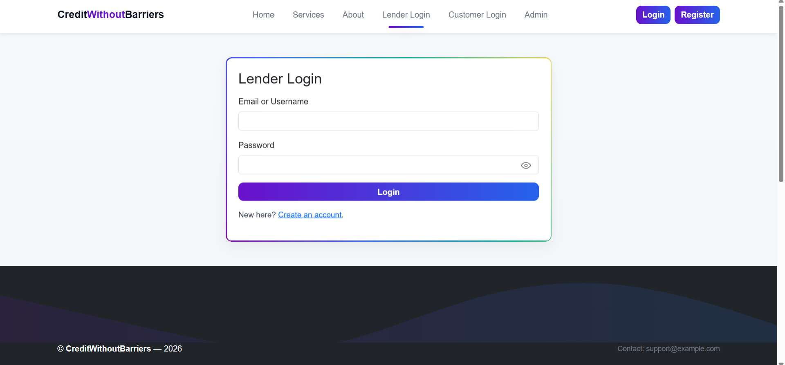
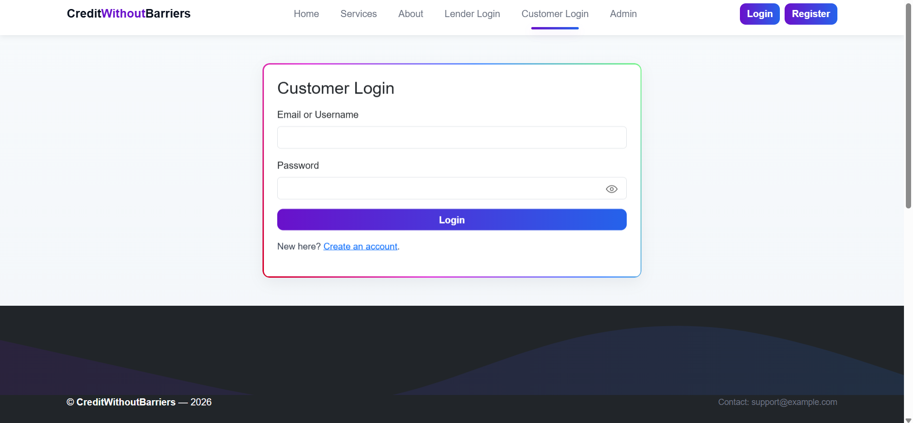

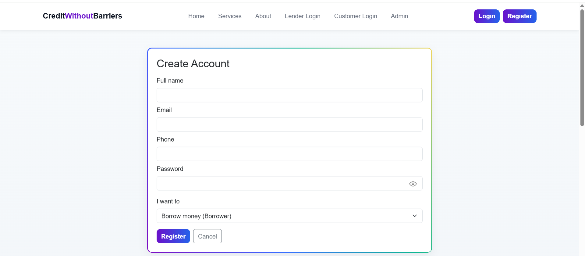

---

###  Borrower Dashboard
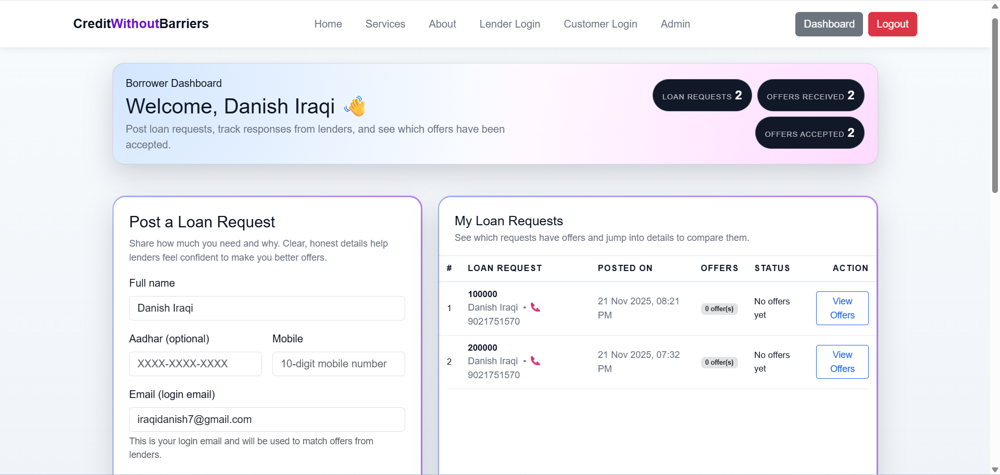

---

###  Lender Dashboard
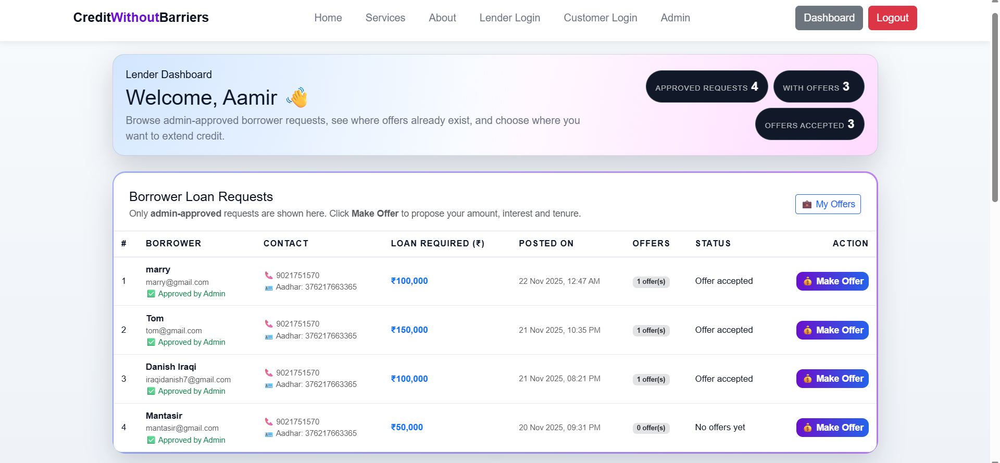

---

###  Admin Dashboard
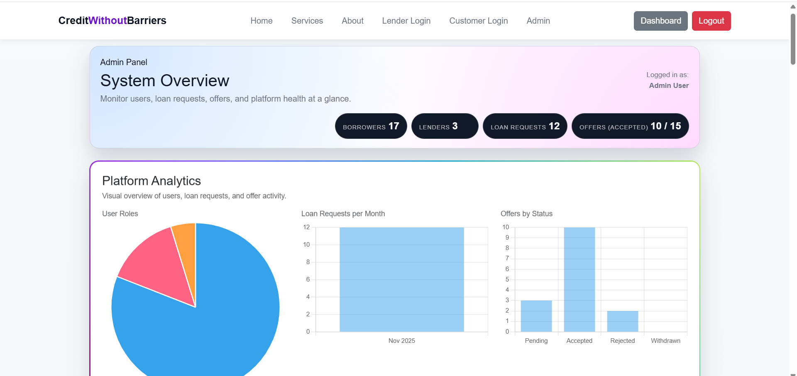
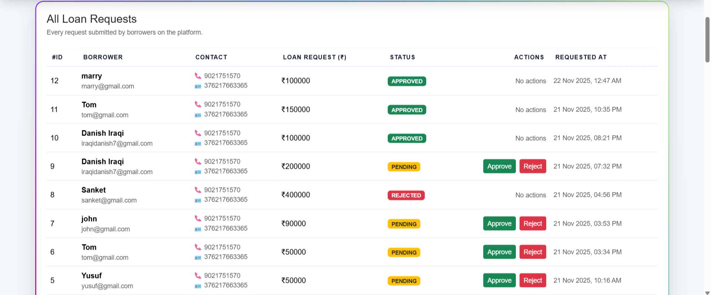
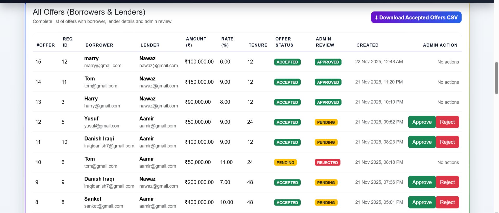
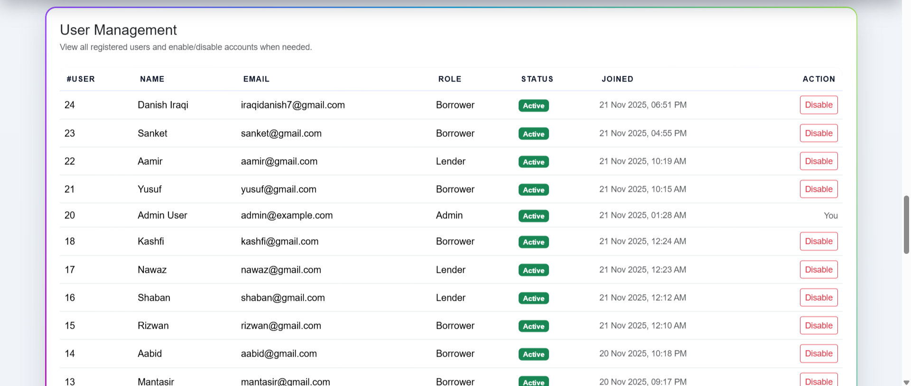

---

###  Offers
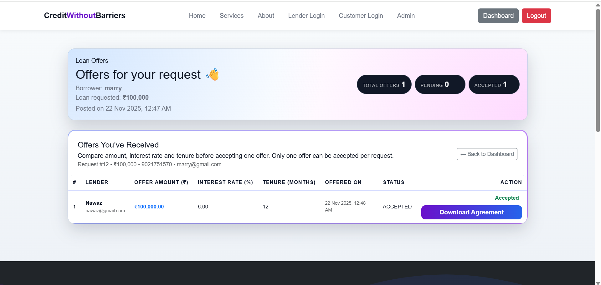

---

###  Agreement
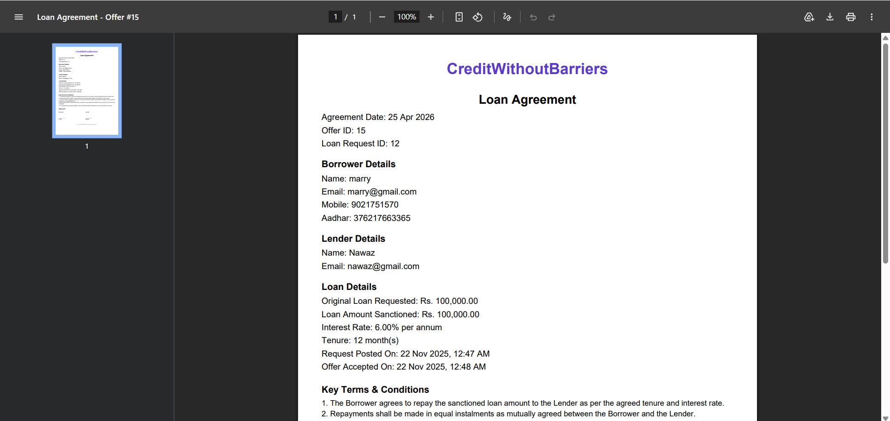
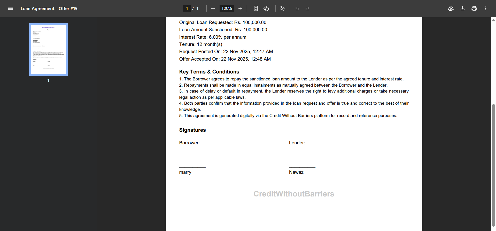
